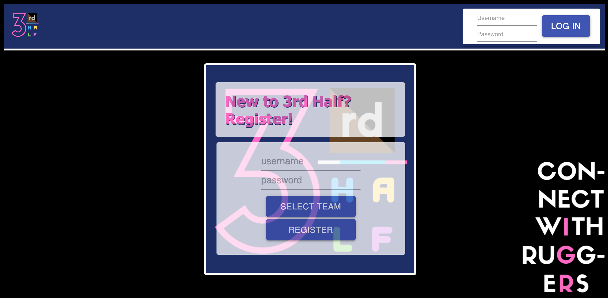
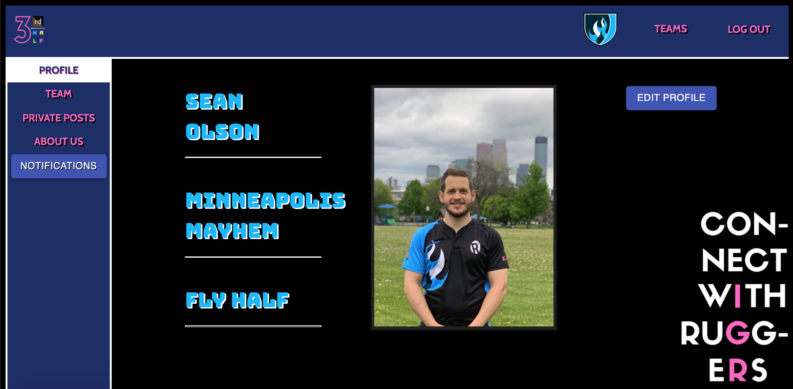
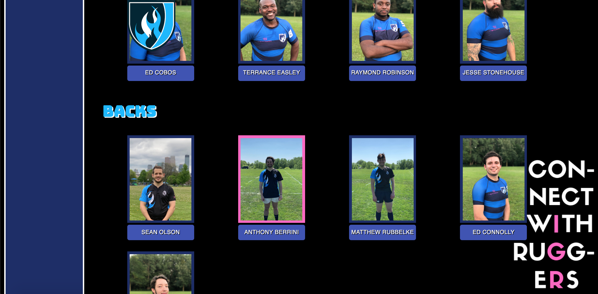
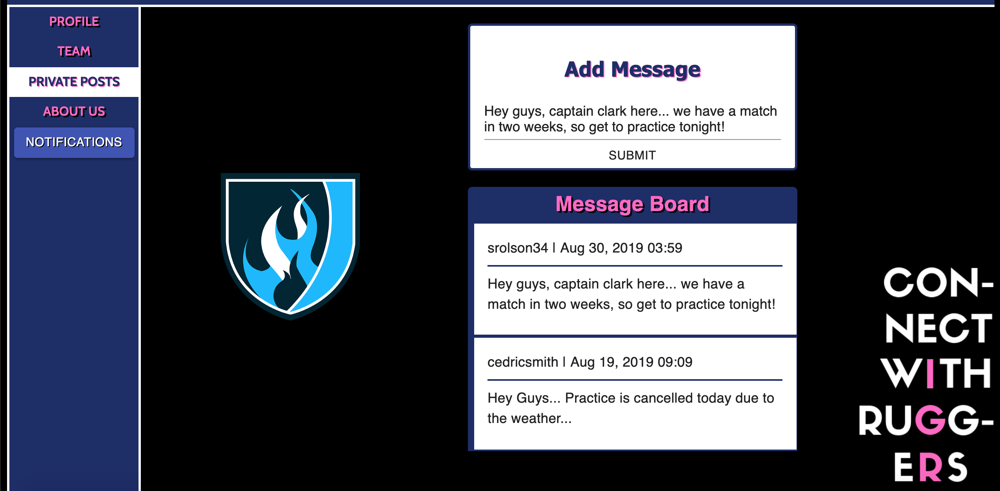
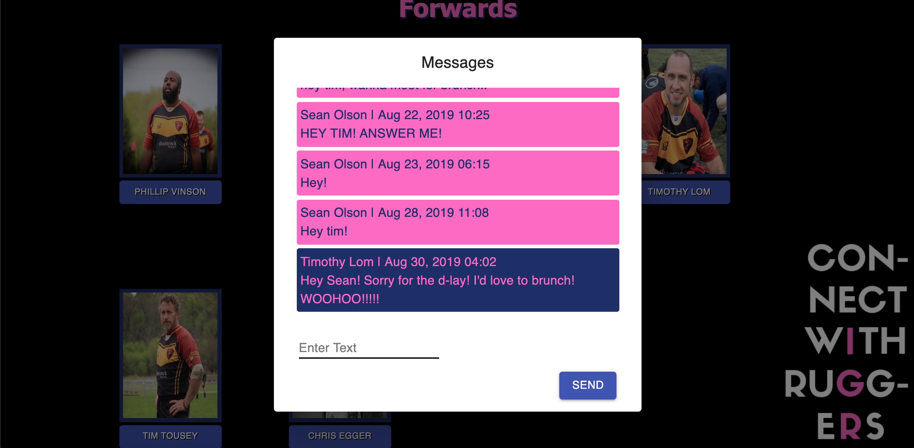

# 3rd Half
In rugby, there are three halfs: The first being played during the match, and the third being the social gathering between the same two teams after the match. 

This is Third Half, an application that provides a safe space for rugby players playing for a registered IGR (International Gay Rugby) team to connect with each other, whether it be with players from other teams, or players within their own team. 

## Getting Started
https://dry-scrubland-41324.herokuapp.com/#/home

Login with these credentials: 
username: guest-user
password: bingham

## Built With
React.js, Node.js, PostgreSQL, Material UI, HTML/CSS 

## Getting Started
These instructions will get you a copy of the project up and running on your local machine for development and testing purposes. See deployment for notes on how to deploy the project on a live system. 

## Steps to get the development environment running.

https://dry-scrubland-41324.herokuapp.com/#/home

OR 

Download the zip file of this repo, then, in the project:
- npm install
- In 2 different terminal tabs:
-   1: npm run server
-   2: npm run client

## Screen Shot

## Documentation

https://docs.google.com/document/d/16jepGmchBoaHJyXu8MgXAETXTnc_1MbL0mTEriohD9M/edit#heading=h.stm015ij3yyj

# Completed Features

A registered user will be able to: 
- login 
- view their profile (Picture, Player/Team description)
- edit their profile infof (Player name/position)
- view their team page - shows a list of their teammates with their pictures
    - user is able to interact/connect with each player individually through a messaging feature 
- view their team's private posts, a section in which announcements that the entire will benefit from seeing (i.e. practice, match updates, etc). 
- view their team's about section 
--------
- view all other teams in IGR by clicking 'teams' in the upper nav bar 
- have the ability to click on any team, and view all members of that team
- have the option to send a message to anyone on that team by clicking their name under their picture 

A new user will be able to: 
- register with a username and password, and choose their team from a dropdown menu 
- once they're registered, they will have the ability to add their name and position by hitting the 'edit profile' button

# Future Features 

- Allow a newly registered user the ability to add a picture through AWS 